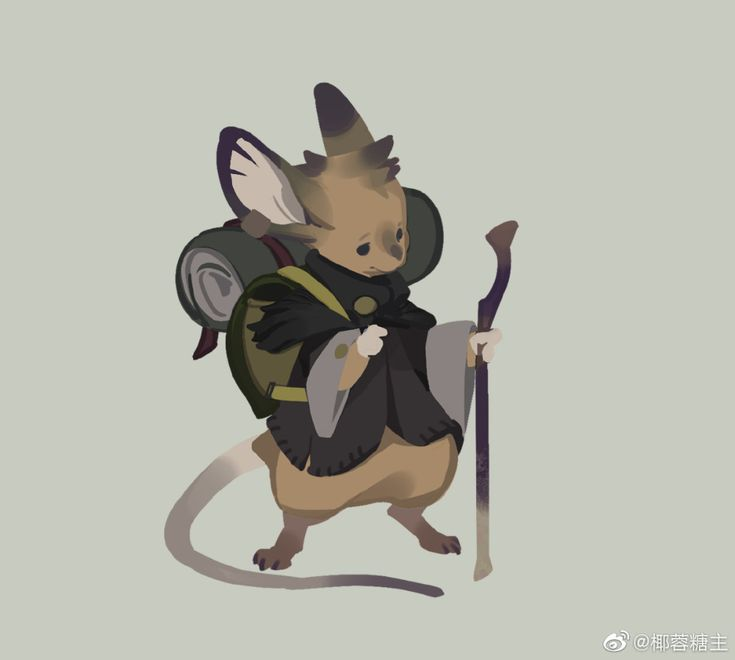

# The Humblewood Table

A cute cottagecore virtual tabletop for running my private Humblewood campaign online.



## Running it locally

Req: [Node.js](https://nodejs.org) installed (v18+).

```bash
npm ci
npm start
```

Then open `http://localhost:3000` in your browser. 

## Deploying with Docker
- **`Dockerfile`** — builds the app into a container.
- **`docker-compose.yml`** — runs it with two persistent volumes: one for the database, one for uploaded map/token images.

The app uses SQLite in a file and the `docker-compose.yml` mounts a volume (`humblewood-data`) so that the file persists across restarts and redeploys automatically (hopefuckingfully).

To update the live version after this, I can just push as normal, then on the terminal:

```bash
git tag x.x.x
git push --tags
```

## Playing with the group

Now hosted on `https://humblewood.sfseeger.de/` !!  

1. Open the site, enter your name, pick **Dungeon Master** or **Player** and click "Enter the Wood" once you enter your profile information.
2. DM-only controls (uploading maps, moving npcs, editing the playlist etc.) are hidden/restricted from players.

## What's built so far 

- **Map & tokens**: DM uploads the battle map image. Tokens for NPCs, items and PCs live in a tray and can be moved, snapped to the grid, hidden from players and given one-by-one HP adjustments. Pan and zoom controls work for everyone. Doodles and NPC/item names can be enabled by DM. Distance can be measured with the Ruler. Battle Fog can be drawn with rectangles. Conditions show up on tokens with its starting letters. 
- **Initiative tracker**: turn order and rounds of NPCs and player characters are all visible directly beside the map (initiative table can be toggled on and off). DM can manually edit and reorder initiatives and their order. NPCs can enter the initiative tracker and have very basic battle functions. May extend this later.
- **Jukebox**: add tracks as files and play them for all users. Adding track name for each track could get tiring? maybe create a "add file" button?
- **Character sheets**: a basic 5e-style sheet (abilities, HP/AC, inventory, notes) per character, added Humblewood characteristics. A tiny reminder of your character can be found on the sidebar of the map page.
- **Character-specific dice**: Select a character to roll ability checks, saving throws, skills, initiative, attacks, spell attacks etc. with the stored modifiers. d20 rolls support advantage and disadvantage and sync to the shared roll log. Spell and combat rolls are accessible on the combat page. To unlock damage rolls on spells, simply write its roll (for example 1d10) in the spell description.
- **Cottagecore Humblewood aesthetic**: parchment and forest tones, vine dividers, soft rounded shapes.
- **Access restrictions**: DM access is PIN-gated. Character ownership is tied to the "Player" field in character sheet. Players must log in with username and password. Password can be changed by DM upon request, however, username shall stay known. Token movement/character rolls are checked server-side.
- **Function automation and Shortcuts**: Long-rest automation. NPC Duplication. Fit map to grid. Middle button of mouse to move around. Automated level up calculations and information screens. NPC Creation automation through stat blocks. Char creation automation through presets and race/class trait displays.
- **Not tested yet - Scene saving as DM**
- **Almanac**: provides necessary information on the Humblewood in an easily organizable and digestible collection.

## Known limitations to work out next
- More humblewood specific vibes? 
- look up summons waa